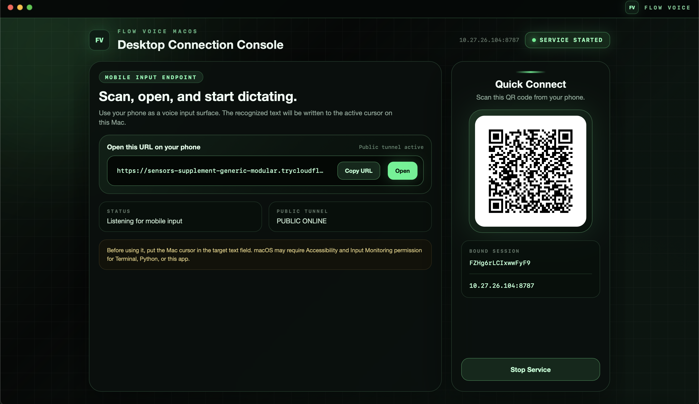
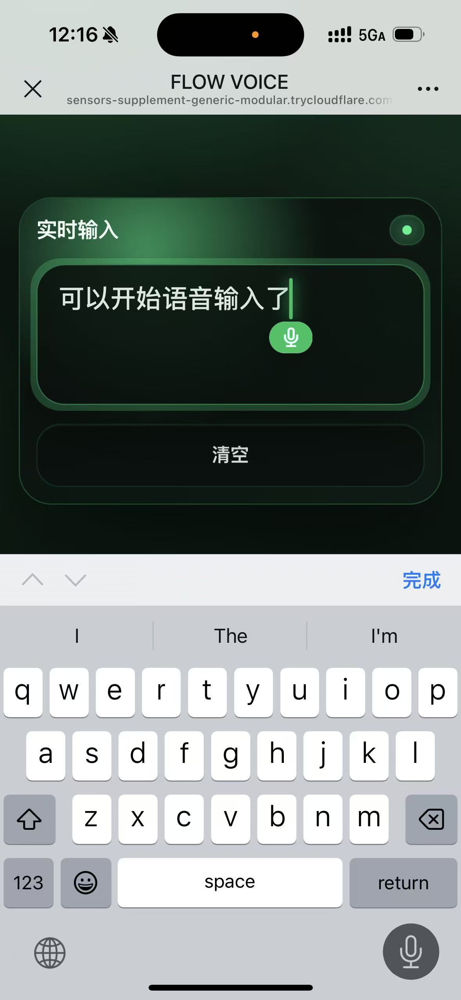

# FlowVoice

FlowVoice 是一个远程语音输入工具：手机负责语音识别，电脑负责把识别出的文字实时输入到当前光标位置。

你可以把它理解成“把手机输入法变成电脑输入法”。手机打开电脑端提供的连接页面后，在手机输入框里打字或使用手机语音输入，文字会同步写入 Windows 或 Mac 当前正在聚焦的输入框。

## 适合什么场景

- 在电脑上写文档、聊天、填表时，用手机语音输入长段文字。
- 在图书馆、办公室等比较安静的场合，可以讲手机凑近，轻声输入
- 电脑没有好用麦克风，或者电脑端语音输入不好用时，用手机输入法替代。
- 不想安装复杂账号体系，只想在自己的设备之间快速输入文字。

Windows 和 macOS 版本都可以直接下载已有的 release 版本使用，也可以按照下面的方法自行配置源码环境。

## 基本用法

1. 在电脑上启动 FlowVoice。
2. 在电脑窗口中点击启动服务。



3. 用手机扫描二维码，或在手机浏览器打开窗口里的连接地址。
4. 把电脑光标放到要输入的位置。
5. 在手机页面输入文字



手机端不需要点击发送。只要手机输入框内容变化，电脑端就会同步输入。


## Windows 版

### 推荐方式：运行发布包

如果你拿到的是发布版，直接运行 Windows 版本中的 `VoiceInput.exe`。

首次运行时，Windows 防火墙可能会询问是否允许网络访问。请允许在专用网络或局域网中访问，否则手机可能打不开连接页面。

启动后：

1. 点击窗口里的 **Start Service**。
2. 用手机扫描二维码，或复制窗口中的 URL 到手机浏览器。
3. 保持电脑和手机在同一个 Wi-Fi 或局域网下。
4. 把 Windows 光标放到目标输入框。
5. 在手机页面输入或语音输入。

如果要向管理员权限的窗口输入文字，请右键 `VoiceInput.exe`，选择“以管理员身份运行”。

### 从源码运行

如果你下载的是源码，在 Windows 电脑上进入：

```powershell
cd Windows_version
python -m venv .venv
.\.venv\Scripts\Activate.ps1
pip install -r requirements.txt
python desktop_client.py
```

也可以双击：

```text
Windows_version/start_desktop_client.bat
```

命令行版本可用于调试：

```powershell
cd Windows_version
python server.py
```

终端会打印类似地址：

```text
http://192.168.1.20:8787/?token=xxxx
```

手机浏览器打开这个地址即可连接。

## macOS 版

### 推荐方式：桌面客户端

macOS 桌面客户端会尝试生成临时公网连接，因此建议先安装 `cloudflared`：

```bash
brew install cloudflared
```

在 Mac 上进入语音输入目录：

```bash
cd macOS_version/macOS_voice_input
./start_desktop_client.sh
```

脚本会自动创建 `.venv`，安装依赖，然后打开 FlowVoice 桌面窗口。

启动后：

1. 点击窗口里的 **Start Service**。
2. 扫描二维码，或把窗口里的连接地址复制到手机浏览器。
3. 把 Mac 光标放到目标输入框。
4. 在手机页面输入或使用手机语音输入法。

macOS 可能会拦截模拟键盘输入。如果手机已经连接，但 Mac 没有输入文字，请打开：

```text
系统设置 -> 隐私与安全性 -> 辅助功能
```

给 Terminal、iTerm、Python，或正在运行 FlowVoice 的应用开启权限。必要时也在：

```text
系统设置 -> 隐私与安全性 -> 输入监控
```

开启对应权限。修改权限后，通常需要重启终端或重新运行 FlowVoice。

### 公网连接

macOS 桌面客户端支持通过 Cloudflare Tunnel 生成临时公网地址。适合手机和 Mac 不在同一个局域网时使用。

安装 `cloudflared`（brew install cloudflare）后启动 FlowVoice，窗口会尝试生成公网 URL。公网地址通常是 `trycloudflare.com` 域名，并且会带上本次会话的 `token`。

注意：

- 公网地址是临时地址，不是固定域名。
- 不要把公网 URL 发给不信任的人。
- 关闭 FlowVoice 后，该地址会失效。

### 从源码手动运行

```bash
cd macOS_version/macOS_voice_input
python3 -m venv .venv
source .venv/bin/activate
pip install -r requirements.txt
python3 desktop_client.py
```

命令行版本可用于调试：

```bash
cd macOS_version/macOS_voice_input
python3 server.py
```

测试 macOS 输入权限：

```bash
python3 server.py --test-text "你好 macOS"
```

运行后 3 秒内把光标放到任意文本框。如果权限正确，Mac 会自动输入测试文字。

## 输入行为说明

- 手机输入框内容会实时同步，不需要点击发送。
- 普通追加文字会立即输入到电脑当前光标处。
- 如果手机语音输入法在句子结束后修正前文，电脑端会从差异位置开始删除并重打一段尾部。
- 手机端换行会在电脑端执行 Enter 或 Return。
- 手机端删除文字会在电脑端发送对应数量的退格。
- 清空手机输入框只会重置本次手机输入状态，不会删除电脑上已经输入过的内容。

## 网络与安全

默认情况下，FlowVoice 面向个人局域网使用：

- 电脑端会监听本机端口，默认端口是 `8787`。
- 手机需要能访问电脑的局域网 IP。
- 每次启动都会生成 session token，连接 URL 中会带上这个 token。
- 不建议把局域网服务直接暴露到公网。

如果使用 macOS 的 Cloudflare Tunnel 公网连接，安全边界变为“临时公网地址 + session token”。请只在可信设备之间使用。

## 常见问题

### 手机打不开电脑地址

- 确认手机和电脑在同一个 Wi-Fi 或局域网。
- 确认 Windows 防火墙允许 FlowVoice 或 Python 访问网络。
- 确认电脑没有连接会隔离局域网设备的访客 Wi-Fi。
- 如果改过端口，确认手机打开的是窗口里最新显示的地址。

### 手机连上了，但电脑没有输入

- 确认电脑光标已经放在目标输入框中。
- Windows 上如果目标窗口是管理员权限运行，FlowVoice 也需要管理员权限。
- macOS 上检查“辅助功能”和“输入监控”权限。
- 某些密码框、安全输入框或受保护应用可能会阻止模拟输入。

### 语音识别准不准

FlowVoice 本身不做语音识别。识别质量取决于你手机上的输入法，例如系统输入法、微信输入法、讯飞输入法等。换一个手机输入法，识别效果也会变化。

## 项目目录

```text
Windows_version/                  Windows 桌面端和服务端
macOS_version/macOS_voice_input/  macOS 语音输入版本
macOS_version/macOS_whiteboard/   macOS 白板桥接实验功能
```

普通用户只需要使用 `Windows_version` 或 `macOS_version/macOS_voice_input`。
